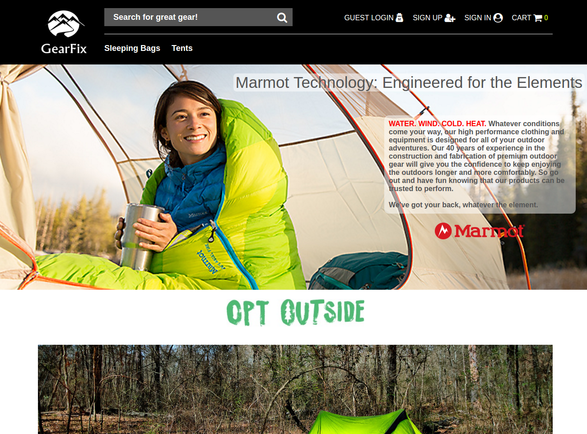
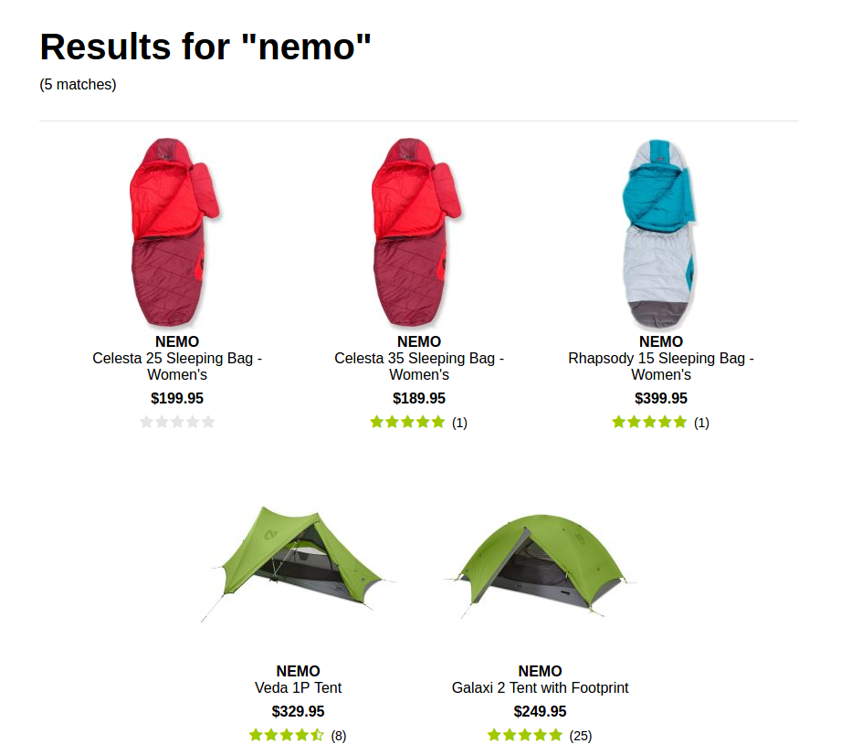
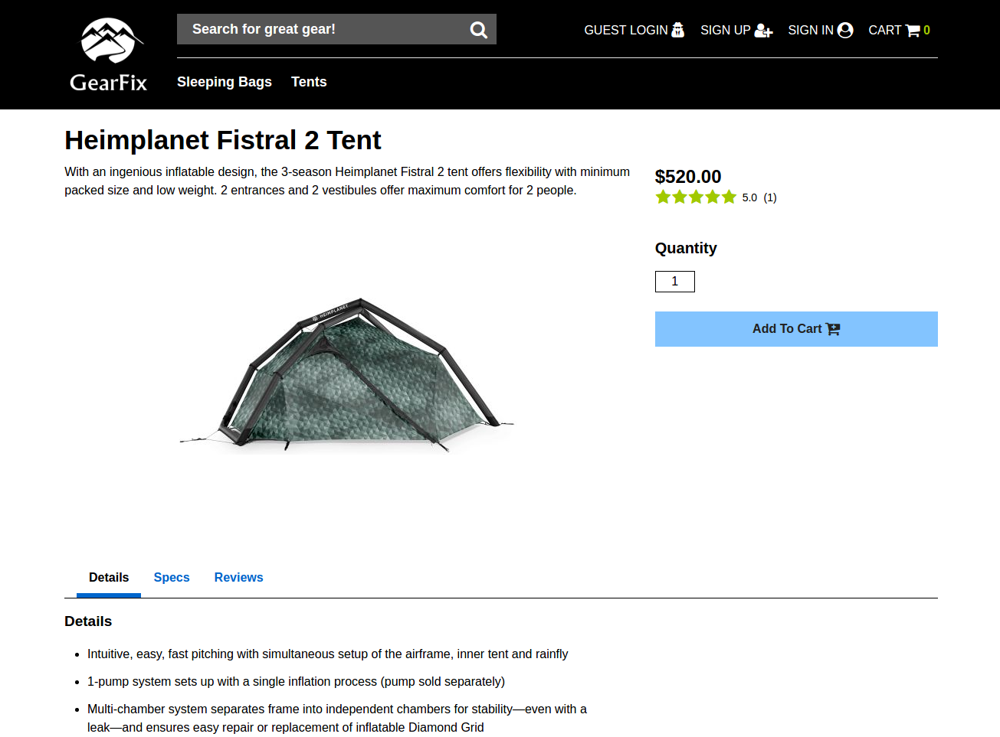
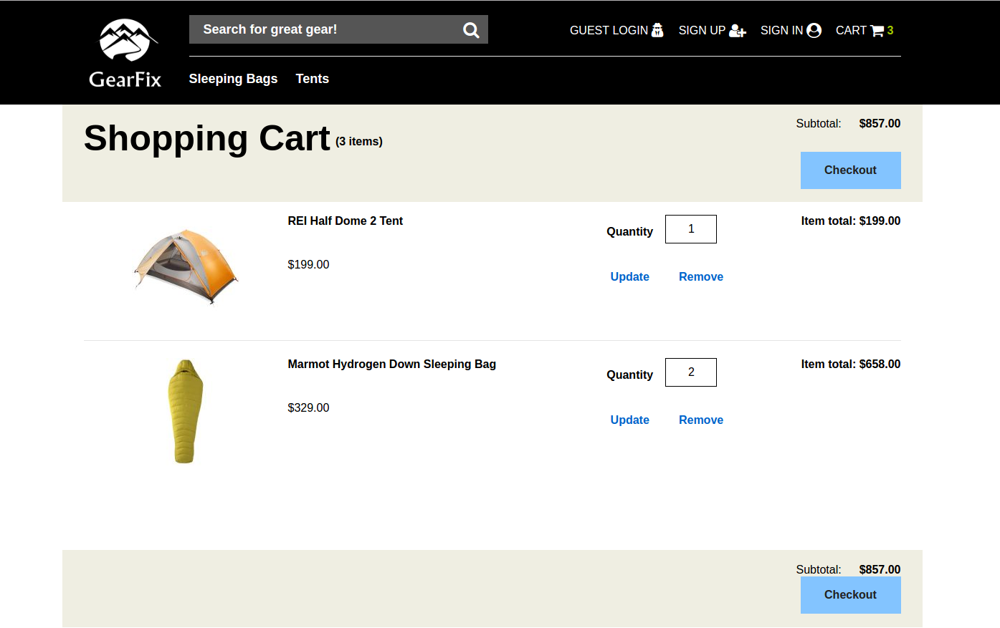

#GearFix

[GearFix live][heroku]

[heroku]: www.gearfix.tech

GearFix is a web application that is inspired by REI. In contrast to the REI site, GearFix is a single page application that runs off of a single static page, and only re-renders the components that are affected by changes in the application state.  GearFix makes use of Ruby on Rails on the back end, a PostgreSQL database, and React.js with the Redux pattern on the front end.  

# Features & Implementation

### User Authentication
GearFix allows a user's session to persist between refreshing and closing the window.  The code that makes this possible lives in both the back end and front end.  Upon logging in, at the back end the user's session token is reset, and the session token is stored in the user's cookie and in the database. If a successful server response is received on the front end by the session reducer, the user's name and id are stored in the window's local storage.  Upon logging out, at the back end the user's session token is reset in the database and the session token in the user's cookie is set to nil.

Because local storage persists between refreshes and closing of the window, the store can be setup with a preloaded state containing user information stored in local storage.  If a user is present, React will attempt to retrieve the user's additional information.  The back end will return this information if the cookie's session token matches up with the user's session token in the database.  As a result, the user will not have to login again if they never logged out in their previous session.  Malicious users attempting to impersonate other users by populating their own window's local storage with a user object will be unable to gain authorization, as they will not have the required session token.

### Persistent Shopping Cart

When logged in, items added to the shopping cart are kept in both the store on the front end and in the database on the back end.  By storing a user's shopping cart in the database, the user's shopping cart is persisted when saving cart items and logging in from different machines / browsers.  

When no user is logged in, items added to the shopping cart are kept on the front end in both the store and the window's local storage.  The redundancy of storing shopping cart items in local storage allows cart items to persist between refreshes and exiting of the browser when no user is signed in.  

Upon logging in, any items that the user previously added to their cart (stored in local storage) are merged with any previously saved cart items from the database.  As this merge occurs, the items stored in local storage are emptied out and the database is updated appropriately.

### Handling of Duplicate Add to Cart Requests

When a logged-in user is viewing a product and clicks the "Add to Cart" button, an action is dispatched, which triggers an HTTP request to add the item to the user's cart in the back end.  If the user already has the product in their cart,
the server updates the quantity of existing database entry and returns a redirection boolean in the server response.

On the front end, the middleware and reducer both listen for the action that updates the user's cart in the store. If the redirection boolean is present, the reducer returns the old state, and the middleware dispatches an action to update the item in the store as opposed to pushing a duplicate item. Similar logic is used to handle "Add to Cart" actions dispatched while no user is logged in, updating the store and local storage appropriately.

On the back end, this setup saves space in the database in the event that a user has large quantities of the same item.  As opposed to having [quantity] number of rows each representing a single item, a single row with a product id, user id, and quantity column is used.  On the front end, I believe this setup offers a more enjoyable user experience.  Currently on the REI website, adding the same item to your cart multiple times yields multiple identical items in your shopping cart, each with their own quantity attribute.  I opted to manage identical items as a single cart object in the store with a net quantity attribute, thereby making it easy to render the shopping cart with a single listing for each product and eliminating the need for a user to ever manually count the quantity of a product.

### Floating Navigation Bar on Product Page
When viewing a single product, additional information is found in 3 sections: details, specifications, and reviews. A navigation bar with links to these 3 sections can be found midway down the page.  Upon scrolling past the Details section, the navigation bar detaches from its static position and become fixed at the top of the window.  This logic is handled in the product details component.

When rendering the component, refs are used to store reference to the DOM nodes representing the Details, Specs, and Reviews sections.  Using these references, the state is populated with locations of these sections on the page, as well as with booleans representing which section is current active / being focused on.  When the component mounts, an on-scroll listener is added to the document, checking the current position of the user's window.  When the user moves past each section, the on-scroll event changes a boolean in the state representing which link in the navigation bar should be active. The state is then passed to the React Classnames library, which uses the boolean values and class name keys to appropriately adjust element class names, thus manipulating their styling by adding and removing active classes.

# Screenshots

## Search Results

## Product Display Page

## Shopping Cart

# Future Directions for the Project

### Search Bar and Filters
Search bar is could use a suggestions / auto-complete feature.  Sidebar filter for results should be implemented.

### More Seeds
Seed more categories and more items per category.

## Refactoring
Reduce number of controlled components, learn how to use refs to access child components and their methods from their parents.  Eliminate unnecessary item from component states that are already being passed in via props.

## Fix Dropdowns in Firefox
Initial naive implementation of opening/closing dropdowns throws errors in Firefox and does not function properly.  Refactor to use onFocus and onBlur.

## Database Changes
Look into storing hashes in a database column as opposed to arrays or strings for product search keywords.  Look into polymorphic associations for the Products table.

### Add Past Purchases
Current upon checking out, the user's shopping cart is simply dumped out. Ideally there would be a mock payment screen and a table to handle past purchases so that they can viewed in the account details.
