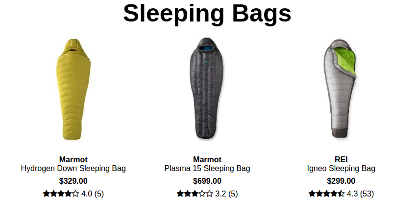
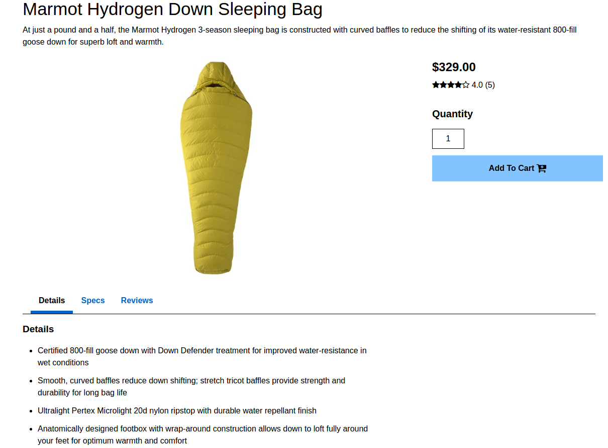

#QuickScope

[GearFix live][heroku]

[heroku]: https://gearfix.herokuapp.com/#/

GearFix is a full-stack web site that is inspired by REI. This web application makes use of Ruby on Rails on the backend, a PostgreSQL database, and React.js with Redux on the frontend for efficient navigation.

## Features & Implementation

### Single-Page Application

In contrast to the REI site, GearFix is a single page application that runs off of a single static page, and only re-renders the components that are affected by changes in the application state.  The root html file is 'bootstrapped' to listen for an current user at any time, and then subsequently stores the user's name and id in
the window.  Redux is then able to check the session key under the Redux store for the window's current user.
Without this feature, exiting a window or tab would result in the user's session being terminated regardless of
whether or not they logged out.

### Convenient Interactive User Authentication

Going along with the single-page application style, user signin, guest login, and account creation is conveniently
available from any page with a single click.  On-click dropdowns are utilized for account creation, user login,
and the displaying of account information, with numerous event listeners setting inline-styles for color and display based on mouse clicks.

### Result Display Page and Individual Product Display Page

Numerous tables were utilized for categorizing and storing product information, by spreading a single product's information over numerous tables.

## Future Directions for the Project

There were numerous MVPs that I was unable to complete for this project, so I will continue working on them in
the future, as well as implementing a few other features as listed below:

### Fix Shopping Cart

The shopping cart feature is not fully working.

### More Seeds

Currently I have only seeded 14 items in the sleeping bags category, I would like to seed to the tents category
and add a few more categories to fill up the navigation bar.

### Search Bar and Filters

Every shopping site needs a working search bar and filters.

### User Reviews

Currently the product database is setup to receive reviews, but the feature to add reviews has not yet been implemented.
